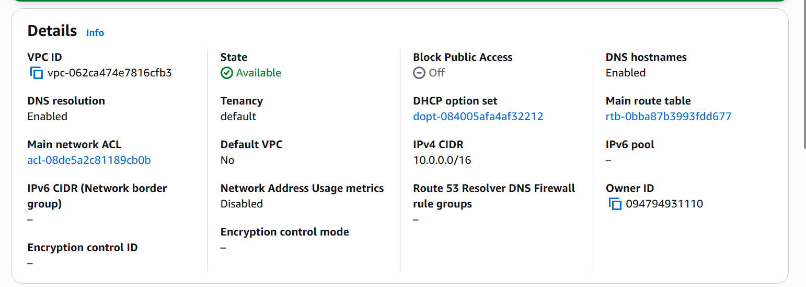
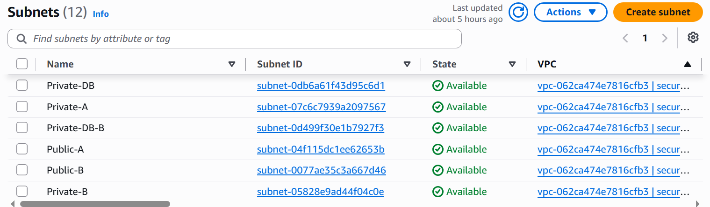
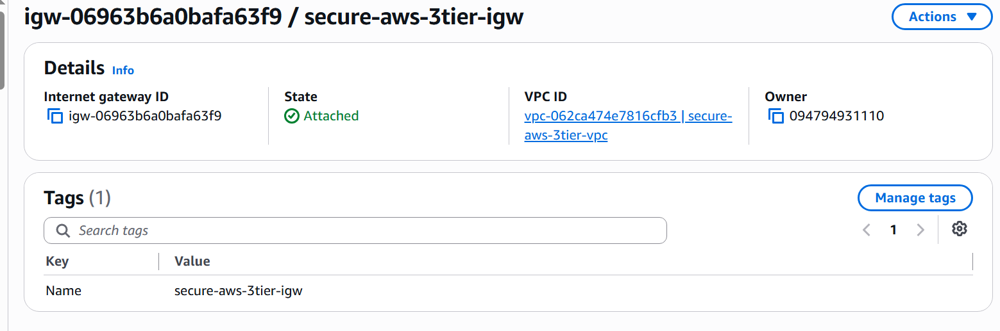
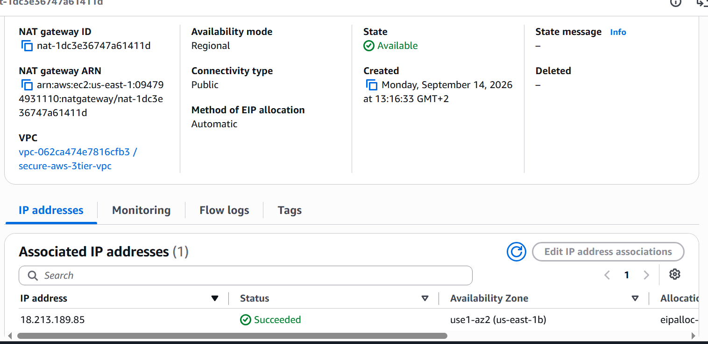
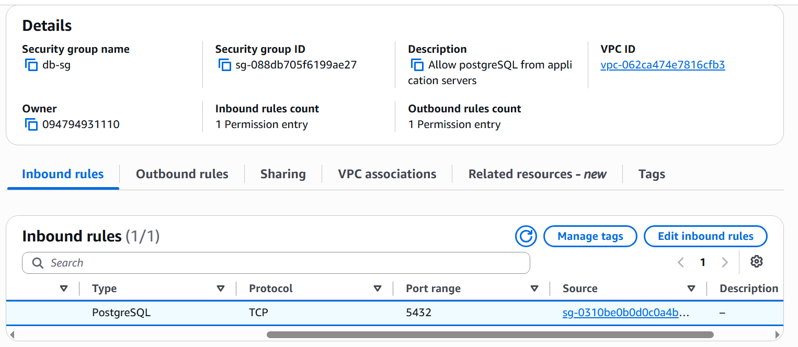

# AWS VPC Networking

## VPC

- CIDR: 10.0.0.0/16
- The VPC provides an isolated network environment for the application infrastructure.

- VPC CIDR: `10.0.0.0/16`
- IPv6: Disabled
- Tenancy: Default
- DNS Resolution: Enabled

## Subnets
   Here VPC is divided into six subnets across two Availability Zones.

### Public Subnets
- Public-A: 10.0.10.0/24
- Public-B: 10.0.20.0/24

### Private Application Subnets
- Private-A: 10.0.11.0/24
- Private-B: 10.0.21.0/24

### Private Database Subnets
- Private-DB: 10.0.12.0/24
- Private-DB-B: 10.0.22.0/24

## Internet Gateway

An Internet Gateway (IGW) provides internet connectivity between the VPC and the public internet.

The IGW is attached to the project VPC and is used by the public route table.

## NAT Gateway

The NAT Gateway allows resources in private subnets to access the internet for outbound traffic without allowing unsolicited inbound internet connections.

Configuration:

- Connectivity: Public
- Availability Mode: Regional
- Elastic IP: Automatically allocated

## Route Tables
Route tables control how network traffic is routed inside the VPC.
### Public Route Table
0.0.0.0/0 → Internet Gateway

### Private Route Table
0.0.0.0/0 → NAT Gateway

### Database Route Table
No internet route.

## Security Design

Security Groups act as virtual firewalls for AWS resources.
They control inbound and outbound traffic at the resource level.

This project uses separate Security Groups for different application layers.

### ALB Security Group
The Application Load Balancer is internet-facing, so HTTP/HTTPS traffic is allowed from the internet.

## Security Groups

### ALB Security Group
- Name: `alb-sg`
- Inbound: HTTP 80 from `0.0.0.0/0`
- Inbound: HTTPS 443 from `0.0.0.0/0`
- Purpose: Allow public web traffic to the Application Load Balancer.

### Application Security Group
- Name: `app-sg`
- Inbound: HTTP 80 from `alb-sg`
- Purpose: Allow application traffic only from the ALB.

### Database Security Group
- Name: `db-sg`
- Inbound: PostgreSQL 5432 from `app-sg`
- Purpose: Allow database access only from application servers.

### Security Flow

Internet
↓
`alb-sg`
↓
ALB
↓
`app-sg`
↓
EC2 Application Servers
↓
`db-sg`
↓
RDS PostgreSQL
